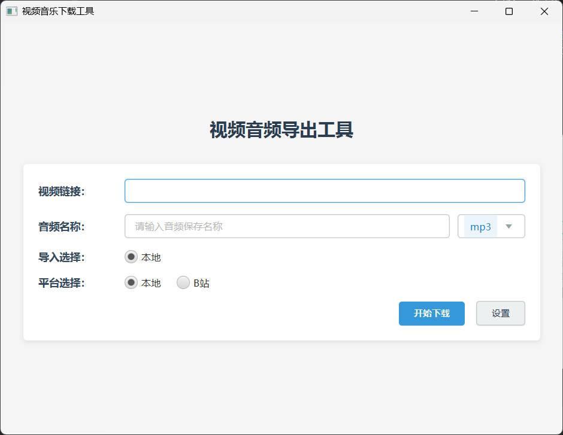

# VideoMusicImport

这是一个用于视频音乐导入的 Java 应用程序，基于 JavaFX 开发。该工具可以帮助用户从视频平台中提取音频。

## 功能特点

- 支持从 BiliBili 等平台下载视频
- 支持视频音频提取
- 多线程下载功能
- 本地保存功能
- 可配置的设置界面
- 图形用户界面（GUI）支持

# 运行页面

## 环境要求

- JDK 11 或更高版本
- Maven 3.6.x 或更高版本
- FFmpeg（用于音频提取）

## 快速开始

1. 克隆项目到本地：
```bash
git clone [项目地址]
```

2. 进入项目目录：
```bash
cd VideoMusicImport
```

3. 使用 Maven 构建项目：
```bash
./mvnw clean package
```

4. 运行应用程序：
```bash
java -jar target/VideoMusicImport-1.0-SNAPSHOT.jar
```

## 使用说明

1. 启动应用程序后，将显示主界面
2. 在设置界面配置下载和保存选项
3. 输入视频链接进行下载
4. 选择是否需要提取音频
5. 等待下载和处理完成


## 技术栈

- Java
- JavaFX
- FFmpeg
- Maven

## 许可证

[待添加许可证信息]

## 贡献

欢迎提交 Issue 和 Pull Request。

## 作者

[作者信息]
